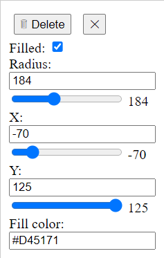
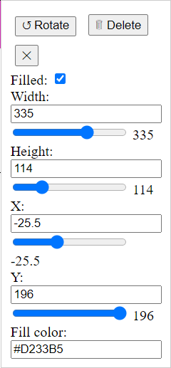
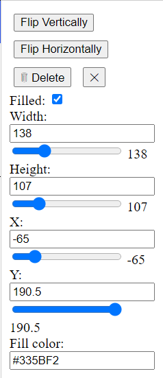

# Centroid Calculator
This is a [Svelte](https://svelte.dev/) based application, which uses JavaScript to draw shapes on the co-ordinate axes, adjust co-ordinates and dimensions, and finally calculate centroid of the shape with respect to the co-ordinate axes.

Currently, only three shapes are supported:
- Rectangle
- Circle
- Triangle

## Working with the calculator
Using the calculator is pretty straightforward. Simply add a shape that you want to calculate the centroid of, adjust its position and dimensions of the shape, and click the `Calculate Centroid` button.

## Available settings
### Circle

### Rectangle

### Triangle
Currently, only right-angled triangles are supported. 

   

> Created by [Sujay R](https://github.com/sujay1844)